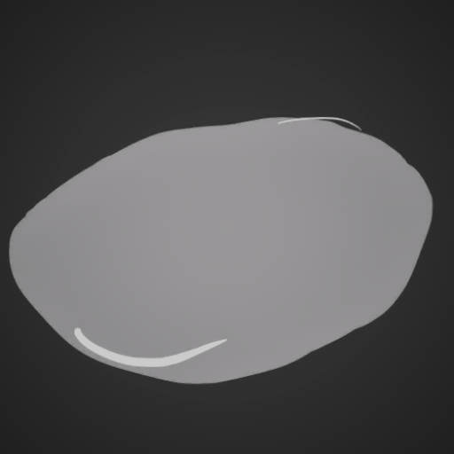

# Actor Transitions

Some functions to make transforming actors during transitions easy and data oriented.
All transitions are async blueprint actions that can be called with ease. They also
come with utility data definitions to make it easier to call the same transition in
multiple places. Here's how the transitions are called in blueprint from the example
above:

|

|

### Future Development

There's currently only one transition type, which is linear interpolation. More
transition types may be added in the future, depending on if they're needed.

